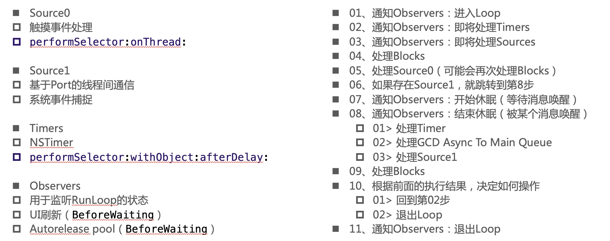
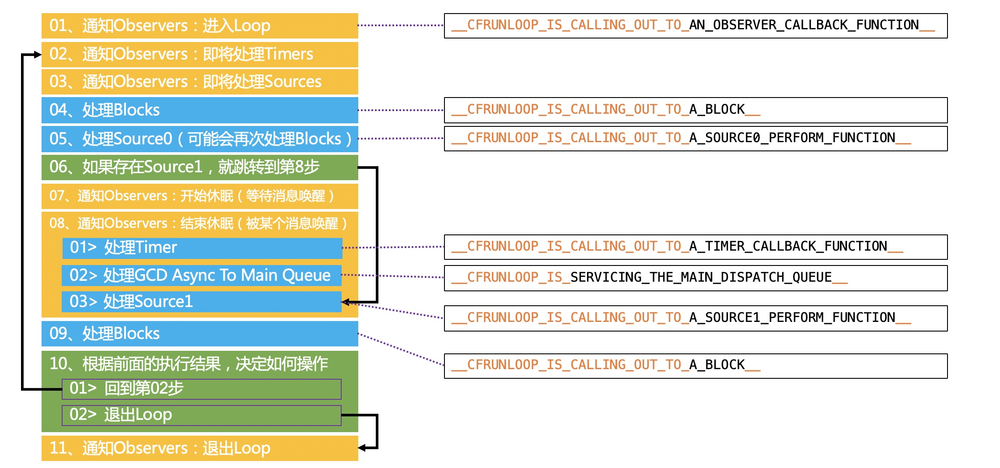

#### 一、 RunLoop简介
 
运行循环:

在程序运行过程中循环做一些事情

应用范畴:

1. 定时器（Timer）、PerformSelector
2. GCD Async Main Queue
3. 事件响应、手势识别、界面刷新
4. 网络请求
5. AutoreleasePool


#### 二、 RunLoop底层代码

```
struct __CFRunLoop {
    CFRuntimeBase _base;
    pthread_mutex_t _lock;			/* locked for accessing mode list */
    __CFPort _wakeUpPort;			// used for CFRunLoopWakeUp 
    Boolean _unused;
    volatile _per_run_data *_perRunData;              // reset for runs of the run loop
    pthread_t _pthread;
    uint32_t _winthread;
    CFMutableSetRef _commonModes;
    CFMutableSetRef _commonModeItems;
    CFRunLoopModeRef _currentMode;
    CFMutableSetRef _modes;
    struct _block_item *_blocks_head;
    struct _block_item *_blocks_tail;
    CFAbsoluteTime _runTime;
    CFAbsoluteTime _sleepTime;
    CFTypeRef _counterpart;
};

```

```
struct __CFRunLoopMode {
    CFRuntimeBase _base;
    pthread_mutex_t _lock;	/* must have the run loop locked before locking this */
    CFStringRef _name;
    Boolean _stopped;
    char _padding[3];
    CFMutableSetRef _sources0;
    CFMutableSetRef _sources1;
    CFMutableArrayRef _observers;
    CFMutableArrayRef _timers;
    CFMutableDictionaryRef _portToV1SourceMap;
    __CFPortSet _portSet;
    CFIndex _observerMask;
#if USE_DISPATCH_SOURCE_FOR_TIMERS
    dispatch_source_t _timerSource;
    dispatch_queue_t _queue;
    Boolean _timerFired; // set to true by the source when a timer has fired
    Boolean _dispatchTimerArmed;
#endif
#if USE_MK_TIMER_TOO
    mach_port_t _timerPort;
    Boolean _mkTimerArmed;
#endif
#if DEPLOYMENT_TARGET_WINDOWS
    DWORD _msgQMask;
    void (*_msgPump)(void);
#endif
    uint64_t _timerSoftDeadline; /* TSR */
    uint64_t _timerHardDeadline; /* TSR */
};

```
#### 二、 添加Observer监听RunLoop的所有状态

```
    //    CFRunLoopObserverRef observe = CFRunLoopObserverCreate(kCFAllocatorDefault, kCFRunLoopAllActivities, YES, 0, runLoopObserverCallBack, NULL);
    CFRunLoopObserverRef observe = CFRunLoopObserverCreateWithHandler(kCFAllocatorDefault, kCFRunLoopAllActivities, YES, 0, ^(CFRunLoopObserverRef observer, CFRunLoopActivity activity) {
        runLoopWithActivityType(activity);
    });
    CFRunLoopAddObserver(CFRunLoopGetMain(), observe, kCFRunLoopCommonModes);
    CFRelease(observe);
    
```

```
void runLoopWithActivityType(CFRunLoopActivity activity){
    
    /*
     kCFRunLoopEntry = (1UL << 0),
     kCFRunLoopBeforeTimers = (1UL << 1),
     kCFRunLoopBeforeSources = (1UL << 2),
     kCFRunLoopBeforeWaiting = (1UL << 5),
     kCFRunLoopAfterWaiting = (1UL << 6),
     kCFRunLoopExit = (1UL << 7),
     */
    switch (activity) {
        case kCFRunLoopEntry:
            NSLog(@"kCFRunLoopEntry");
            break;
        case kCFRunLoopBeforeTimers:
            NSLog(@"kCFRunLoopBeforeTimers");
            break;
        case kCFRunLoopBeforeSources:
            NSLog(@"kCFRunLoopBeforeSources");
            break;
        case kCFRunLoopBeforeWaiting:
            NSLog(@"kCFRunLoopBeforeWaiting");
            break;
        case kCFRunLoopExit:
            NSLog(@"kCFRunLoopExit");
            break;
        default:
            break;
    }
}

```

#### 三、 RunLoop的运行逻辑







#### 四、 RunLoop的应用


