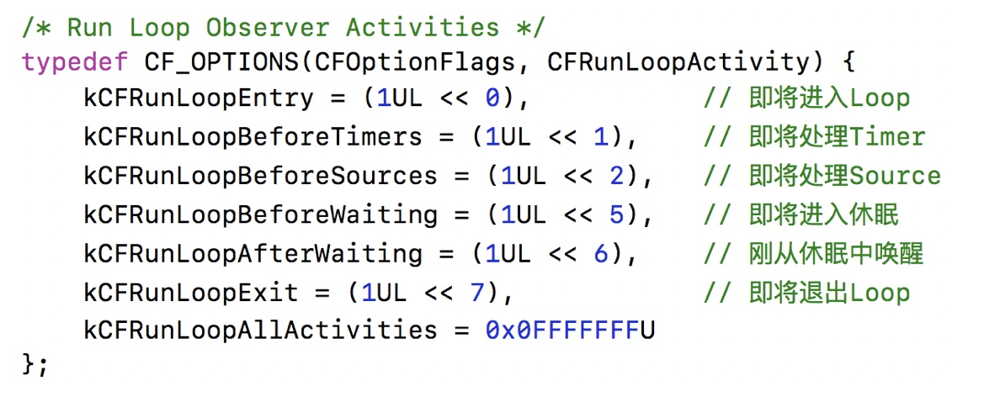
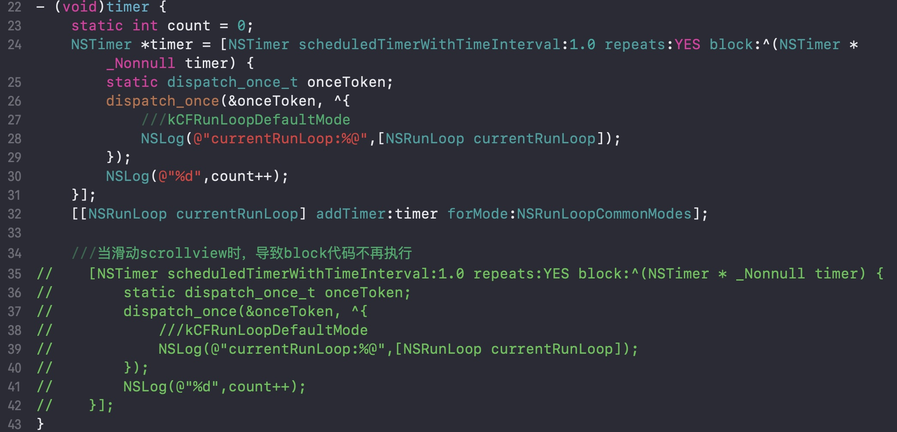

#### 一、 RunLoop简介
 
运行循环:

在程序运行过程中循环做一些事情

应用范畴:

1. 定时器（Timer）、PerformSelector
2. GCD Async Main Queue
3. 事件响应、手势识别、界面刷新
4. 网络请求
5. AutoreleasePool

RunLoop与线程

1. 每条线程都有唯一的一个与之对应的RunLoop对象
2. RunLoop对象保存在全局的Dictionary里，线程作为key，RunLoop作为value
3. 线程创建时并没有创建RunLoop对象，RunLoop对象是第一次获取它的时候创建
4. RunLoop会在线程结束时销毁
5. 主线程的RunLoop已经自动获取（创建），子线程默认没有开启RunLoop

RunLoop状态：



#### 苹果不允许直接创建 RunLoop，它只提供了两个自动获取的函数：CFRunLoopGetMain() 和 CFRunLoopGetCurrent()。 这两个函数内部的逻辑大概是下面这样:

```
/// 全局的Dictionary，key 是 pthread_t， value 是 CFRunLoopRef
static CFMutableDictionaryRef loopsDic;
/// 访问 loopsDic 时的锁
static CFSpinLock_t loopsLock;
 
/// 获取一个 pthread 对应的 RunLoop。
CFRunLoopRef _CFRunLoopGet(pthread_t thread) {
    OSSpinLockLock(&loopsLock);
    
    if (!loopsDic) {
        // 第一次进入时，初始化全局Dic，并先为主线程创建一个 RunLoop。
        loopsDic = CFDictionaryCreateMutable();
        CFRunLoopRef mainLoop = _CFRunLoopCreate();
        CFDictionarySetValue(loopsDic, pthread_main_thread_np(), mainLoop);
    }
    
    /// 直接从 Dictionary 里获取。
    CFRunLoopRef loop = CFDictionaryGetValue(loopsDic, thread));
    
    if (!loop) {
        /// 取不到时，创建一个
        loop = _CFRunLoopCreate();
        CFDictionarySetValue(loopsDic, thread, loop);
        /// 注册一个回调，当线程销毁时，顺便也销毁其对应的 RunLoop。
        _CFSetTSD(..., thread, loop, __CFFinalizeRunLoop);
    }
    
    OSSpinLockUnLock(&loopsLock);
    return loop;
}
 
CFRunLoopRef CFRunLoopGetMain() {
    return _CFRunLoopGet(pthread_main_thread_np());
}
 
CFRunLoopRef CFRunLoopGetCurrent() {
    return _CFRunLoopGet(pthread_self());
}
```

#### 二、 RunLoop底层代码


一个 RunLoop 包含若干个 Mode，每个 Mode 又包含若干个 Source/Timer/Observer。每次调用 RunLoop 的主函数时，只能指定其中一个 Mode，这个Mode被称作 CurrentMode。如果需要切换 Mode，只能退出 Loop，再重新指定一个 Mode 进入。这样做主要是为了分隔开不同组的 Source/Timer/Observer，让其互不影响。

相关的类：

```
Core Foundation中关于RunLoop的5个类
CFRunLoopRef
CFRunLoopModeRef
CFRunLoopSourceRef
CFRunLoopTimerRef
CFRunLoopObserverRef

```

		

```
struct __CFRunLoop {
    CFRuntimeBase _base;
    pthread_mutex_t _lock;			/* locked for accessing mode list */
    __CFPort _wakeUpPort;			// used for CFRunLoopWakeUp 
    Boolean _unused;
    volatile _per_run_data *_perRunData;              // reset for runs of the run loop
    pthread_t _pthread;
    uint32_t _winthread;
    CFMutableSetRef _commonModes;
    CFMutableSetRef _commonModeItems;
    CFRunLoopModeRef _currentMode;
    CFMutableSetRef _modes;
    struct _block_item *_blocks_head;
    struct _block_item *_blocks_tail;
    CFAbsoluteTime _runTime;
    CFAbsoluteTime _sleepTime;
    CFTypeRef _counterpart;
};

```

```
struct __CFRunLoopMode {
    CFRuntimeBase _base;
    pthread_mutex_t _lock;	/* must have the run loop locked before locking this */
    CFStringRef _name;
    Boolean _stopped;
    char _padding[3];
    CFMutableSetRef _sources0;
    CFMutableSetRef _sources1;
    CFMutableArrayRef _observers;
    CFMutableArrayRef _timers;
    CFMutableDictionaryRef _portToV1SourceMap;
    __CFPortSet _portSet;
    CFIndex _observerMask;
#if USE_DISPATCH_SOURCE_FOR_TIMERS
    dispatch_source_t _timerSource;
    dispatch_queue_t _queue;
    Boolean _timerFired; // set to true by the source when a timer has fired
    Boolean _dispatchTimerArmed;
#endif
#if USE_MK_TIMER_TOO
    mach_port_t _timerPort;
    Boolean _mkTimerArmed;
#endif
#if DEPLOYMENT_TARGET_WINDOWS
    DWORD _msgQMask;
    void (*_msgPump)(void);
#endif
    uint64_t _timerSoftDeadline; /* TSR */
    uint64_t _timerHardDeadline; /* TSR */
};

```


#### 二、 添加Observer监听RunLoop的所有状态

```
    //    CFRunLoopObserverRef observe = CFRunLoopObserverCreate(kCFAllocatorDefault, kCFRunLoopAllActivities, YES, 0, runLoopObserverCallBack, NULL);
    CFRunLoopObserverRef observe = CFRunLoopObserverCreateWithHandler(kCFAllocatorDefault, kCFRunLoopAllActivities, YES, 0, ^(CFRunLoopObserverRef observer, CFRunLoopActivity activity) {
        runLoopWithActivityType(activity);
    });
    CFRunLoopAddObserver(CFRunLoopGetMain(), observe, kCFRunLoopCommonModes);
    CFRelease(observe);
    
```

```
void runLoopWithActivityType(CFRunLoopActivity activity){
    
    /*
     kCFRunLoopEntry = (1UL << 0),
     kCFRunLoopBeforeTimers = (1UL << 1),
     kCFRunLoopBeforeSources = (1UL << 2),
     kCFRunLoopBeforeWaiting = (1UL << 5),
     kCFRunLoopAfterWaiting = (1UL << 6),
     kCFRunLoopExit = (1UL << 7),
     */
    switch (activity) {
             ///
        case kCFRunLoopEntry:
            NSLog(@"kCFRunLoopEntry");
            break;
        case kCFRunLoopBeforeTimers:
            NSLog(@"kCFRunLoopBeforeTimers");
            break;
        case kCFRunLoopBeforeSources:
            NSLog(@"kCFRunLoopBeforeSources");
            break;
        case kCFRunLoopBeforeWaiting:
            NSLog(@"kCFRunLoopBeforeWaiting");
            break;
        case kCFRunLoopExit:
            NSLog(@"kCFRunLoopExit");
            break;
        default:
            break;
    }
}

```

#### 三、 RunLoop的运行逻辑


#### 四、 RunLoop的源码分析

##### 4.1、 runLoop开始执行
```
void CFRunLoopRun(void) {    /* DOES CALLOUT */
    int32_t result;
    do {
        result = CFRunLoopRunSpecific(CFRunLoopGetCurrent(), kCFRunLoopDefaultMode, 1.0e10, false);
        CHECK_FOR_FORK();
    } while (kCFRunLoopRunStopped != result && kCFRunLoopRunFinished != result);
}
```
##### 4.1、 处理逻辑

```
SInt32 CFRunLoopRunSpecific(CFRunLoopRef rl, CFStringRef modeName, CFTimeInterval seconds, Boolean returnAfterSourceHandled) {     /* DOES CALLOUT */
//    CHECK_FOR_FORK();
//    if (__CFRunLoopIsDeallocating(rl)) return kCFRunLoopRunFinished;
//    __CFRunLoopLock(rl);
//    CFRunLoopModeRef currentMode = __CFRunLoopFindMode(rl, modeName, false);
//    if (NULL == currentMode || __CFRunLoopModeIsEmpty(rl, currentMode, rl->_currentMode)) {
//        Boolean did = false;
//        if (currentMode) __CFRunLoopModeUnlock(currentMode);
//        __CFRunLoopUnlock(rl);
//        return did ? kCFRunLoopRunHandledSource : kCFRunLoopRunFinished;
//    }
//    volatile _per_run_data *previousPerRun = __CFRunLoopPushPerRunData(rl);
//    CFRunLoopModeRef previousMode = rl->_currentMode;
//    rl->_currentMode = currentMode;
//    int32_t result = kCFRunLoopRunFinished;
    
//    if (currentMode->_observerMask & kCFRunLoopEntry )
    ///通知observer:进入Loop
        __CFRunLoopDoObservers(rl, currentMode, kCFRunLoopEntry);
    ///核心的loop逻辑
    result = __CFRunLoopRun(rl, currentMode, seconds, returnAfterSourceHandled, previousMode);
//    if (currentMode->_observerMask & kCFRunLoopExit )
    ///通知observer:退出Loop
        __CFRunLoopDoObservers(rl, currentMode, kCFRunLoopExit);
    
//    __CFRunLoopModeUnlock(currentMode);
//    __CFRunLoopPopPerRunData(rl, previousPerRun);
//    rl->_currentMode = previousMode;
//    __CFRunLoopUnlock(rl);
    return result;
}

/* rl, rlm are locked on entrance and exit */
static int32_t __CFRunLoopRun(CFRunLoopRef rl, CFRunLoopModeRef rlm, CFTimeInterval seconds, Boolean stopAfterHandle, CFRunLoopModeRef previousMode) {
//    uint64_t startTSR = mach_absolute_time();
//
//    if (__CFRunLoopIsStopped(rl)) {
//        __CFRunLoopUnsetStopped(rl);
//        return kCFRunLoopRunStopped;
//    } else if (rlm->_stopped) {
//        rlm->_stopped = false;
//        return kCFRunLoopRunStopped;
//    }
//
//    mach_port_name_t dispatchPort = MACH_PORT_NULL;
//    Boolean libdispatchQSafe = pthread_main_np() && ((HANDLE_DISPATCH_ON_BASE_INVOCATION_ONLY && NULL == previousMode) || (!HANDLE_DISPATCH_ON_BASE_INVOCATION_ONLY && 0 == _CFGetTSD(__CFTSDKeyIsInGCDMainQ)));
//    if (libdispatchQSafe && (CFRunLoopGetMain() == rl) && CFSetContainsValue(rl->_commonModes, rlm->_name)) dispatchPort = _dispatch_get_main_queue_port_4CF();
//
//#if USE_DISPATCH_SOURCE_FOR_TIMERS
//    mach_port_name_t modeQueuePort = MACH_PORT_NULL;
//    if (rlm->_queue) {
//        modeQueuePort = _dispatch_runloop_root_queue_get_port_4CF(rlm->_queue);
//        if (!modeQueuePort) {
//            CRASH("Unable to get port for run loop mode queue (%d)", -1);
//        }
//    }
//#endif
//
//    dispatch_source_t timeout_timer = NULL;
//    struct __timeout_context *timeout_context = (struct __timeout_context *)malloc(sizeof(*timeout_context));
//    if (seconds <= 0.0) { // instant timeout
//        seconds = 0.0;
//        timeout_context->termTSR = 0ULL;
//    } else if (seconds <= TIMER_INTERVAL_LIMIT) {
//        dispatch_queue_t queue = pthread_main_np() ? __CFDispatchQueueGetGenericMatchingMain() : __CFDispatchQueueGetGenericBackground();
//        timeout_timer = dispatch_source_create(DISPATCH_SOURCE_TYPE_TIMER, 0, 0, queue);
//        dispatch_retain(timeout_timer);
//        timeout_context->ds = timeout_timer;
//        timeout_context->rl = (CFRunLoopRef)CFRetain(rl);
//        timeout_context->termTSR = startTSR + __CFTimeIntervalToTSR(seconds);
//        dispatch_set_context(timeout_timer, timeout_context); // source gets ownership of context
//        dispatch_source_set_event_handler_f(timeout_timer, __CFRunLoopTimeout);
//        dispatch_source_set_cancel_handler_f(timeout_timer, __CFRunLoopTimeoutCancel);
//        uint64_t ns_at = (uint64_t)((__CFTSRToTimeInterval(startTSR) + seconds) * 1000000000ULL);
//        dispatch_source_set_timer(timeout_timer, dispatch_time(1, ns_at), DISPATCH_TIME_FOREVER, 1000ULL);
//        dispatch_resume(timeout_timer);
//    } else { // infinite timeout
//        seconds = 9999999999.0;
//        timeout_context->termTSR = UINT64_MAX;
//    }
//
//    Boolean didDispatchPortLastTime = true;
    int32_t retVal = 0;
    do {
        
//        if (rlm->_observerMask & kCFRunLoopBeforeTimers)
        ///通知observer:即将处理Timers
        __CFRunLoopDoObservers(rl, rlm, kCFRunLoopBeforeTimers);
//        if (rlm->_observerMask & kCFRunLoopBeforeSources)
        ///通知observer:即将处理sources
        __CFRunLoopDoObservers(rl, rlm, kCFRunLoopBeforeSources);
        ///通知observer:处理block
        __CFRunLoopDoBlocks(rl, rlm);
        
//        Boolean sourceHandledThisLoop =
        ///处理source0
        __CFRunLoopDoSources0(rl, rlm, stopAfterHandle);
//        if (sourceHandledThisLoop) {
        ///处理blocks
        __CFRunLoopDoBlocks(rl, rlm);
//        }
        
        Boolean poll = sourceHandledThisLoop || (0ULL == timeout_context->termTSR);
        
//        if (MACH_PORT_NULL != dispatchPort && !didDispatchPortLastTime) {
//#if DEPLOYMENT_TARGET_MACOSX || DEPLOYMENT_TARGET_EMBEDDED || DEPLOYMENT_TARGET_EMBEDDED_MINI
//            msg = (mach_msg_header_t *)msg_buffer;
            ///如果有source1，就跳转到handle_msg标记处
            if (__CFRunLoopServiceMachPort(dispatchPort, &msg, sizeof(msg_buffer), &livePort, 0, &voucherState, NULL)) {
                goto handle_msg;
            }
//        }
        
        didDispatchPortLastTime = false;
        
        if (!poll && (rlm->_observerMask & kCFRunLoopBeforeWaiting)) __CFRunLoopDoObservers(rl, rlm, kCFRunLoopBeforeWaiting);
        __CFRunLoopSetSleeping(rl);
        // do not do any user callouts after this point (after notifying of sleeping)
        
        // Must push the local-to-this-activation ports in on every loop
        // iteration, as this mode could be run re-entrantly and we don't
        // want these ports to get serviced.
        
        __CFPortSetInsert(dispatchPort, waitSet);
        
//        __CFRunLoopModeUnlock(rlm);
//        __CFRunLoopUnlock(rl);
        
        CFAbsoluteTime sleepStart = poll ? 0.0 : CFAbsoluteTimeGetCurrent();
        
#if DEPLOYMENT_TARGET_MACOSX || DEPLOYMENT_TARGET_EMBEDDED || DEPLOYMENT_TARGET_EMBEDDED_MINI
#if USE_DISPATCH_SOURCE_FOR_TIMERS
        
        ///进入休眠，等待其他消息唤醒
        do {
            if (kCFUseCollectableAllocator) {
                // objc_clear_stack(0);
                // <rdar://problem/16393959>
                memset(msg_buffer, 0, sizeof(msg_buffer));
            }
            msg = (mach_msg_header_t *)msg_buffer;
            
            __CFRunLoopServiceMachPort(waitSet, &msg, sizeof(msg_buffer), &livePort, poll ? 0 : TIMEOUT_INFINITY, &voucherState, &voucherCopy);
            
            if (modeQueuePort != MACH_PORT_NULL && livePort == modeQueuePort) {
                // Drain the internal queue. If one of the callout blocks sets the timerFired flag, break out and service the timer.
                while (_dispatch_runloop_root_queue_perform_4CF(rlm->_queue));
                if (rlm->_timerFired) {
                    // Leave livePort as the queue port, and service timers below
                    rlm->_timerFired = false;
                    break;
                } else {
                    if (msg && msg != (mach_msg_header_t *)msg_buffer) free(msg);
                }
            } else {
                // Go ahead and leave the inner loop.
                break;
            }
        } while (1);
#else
        if (kCFUseCollectableAllocator) {
            // objc_clear_stack(0);
            // <rdar://problem/16393959>
            memset(msg_buffer, 0, sizeof(msg_buffer));
        }
        msg = (mach_msg_header_t *)msg_buffer;
        __CFRunLoopServiceMachPort(waitSet, &msg, sizeof(msg_buffer), &livePort, poll ? 0 : TIMEOUT_INFINITY, &voucherState, &voucherCopy);
#endif
        
        __CFRunLoopLock(rl);
        __CFRunLoopModeLock(rlm);
        
        rl->_sleepTime += (poll ? 0.0 : (CFAbsoluteTimeGetCurrent() - sleepStart));
        
        // Must remove the local-to-this-activation ports in on every loop
        // iteration, as this mode could be run re-entrantly and we don't
        // want these ports to get serviced. Also, we don't want them left
        // in there if this function returns.
        
        __CFPortSetRemove(dispatchPort, waitSet);
        
        __CFRunLoopSetIgnoreWakeUps(rl);
        
        // user callouts now OK again
        __CFRunLoopUnsetSleeping(rl);
        if (!poll && (rlm->_observerMask & kCFRunLoopAfterWaiting)) __CFRunLoopDoObservers(rl, rlm, kCFRunLoopAfterWaiting);
        
    handle_msg:;
        __CFRunLoopSetIgnoreWakeUps(rl);
        
        if (MACH_PORT_NULL == livePort) {
            CFRUNLOOP_WAKEUP_FOR_NOTHING();
            // handle nothing
        } else if (livePort == rl->_wakeUpPort) {
            CFRUNLOOP_WAKEUP_FOR_WAKEUP();
            // do nothing on Mac OS
        }
#if USE_DISPATCH_SOURCE_FOR_TIMERS
        else if (modeQueuePort != MACH_PORT_NULL && livePort == modeQueuePort) {
            CFRUNLOOP_WAKEUP_FOR_TIMER();
            if (!__CFRunLoopDoTimers(rl, rlm, mach_absolute_time())) {
                // Re-arm the next timer, because we apparently fired early
                __CFArmNextTimerInMode(rlm, rl);
            }
        }
#endif
#if USE_MK_TIMER_TOO
        else if (rlm->_timerPort != MACH_PORT_NULL && livePort == rlm->_timerPort) {
            CFRUNLOOP_WAKEUP_FOR_TIMER();
            // On Windows, we have observed an issue where the timer port is set before the time which we requested it to be set. For example, we set the fire time to be TSR 167646765860, but it is actually observed firing at TSR 167646764145, which is 1715 ticks early. The result is that, when __CFRunLoopDoTimers checks to see if any of the run loop timers should be firing, it appears to be 'too early' for the next timer, and no timers are handled.
            // In this case, the timer port has been automatically reset (since it was returned from MsgWaitForMultipleObjectsEx), and if we do not re-arm it, then no timers will ever be serviced again unless something adjusts the timer list (e.g. adding or removing timers). The fix for the issue is to reset the timer here if CFRunLoopDoTimers did not handle a timer itself. 9308754
            if (!__CFRunLoopDoTimers(rl, rlm, mach_absolute_time())) {
                // Re-arm the next timer
                __CFArmNextTimerInMode(rlm, rl);
            }
        }
#endif
        else if (livePort == dispatchPort) {
            CFRUNLOOP_WAKEUP_FOR_DISPATCH();
            __CFRunLoopModeUnlock(rlm);
            __CFRunLoopUnlock(rl);
            _CFSetTSD(__CFTSDKeyIsInGCDMainQ, (void *)6, NULL);
            
            __CFRUNLOOP_IS_SERVICING_THE_MAIN_DISPATCH_QUEUE__(msg);
            _CFSetTSD(__CFTSDKeyIsInGCDMainQ, (void *)0, NULL);
            __CFRunLoopLock(rl);
            __CFRunLoopModeLock(rlm);
            sourceHandledThisLoop = true;
            didDispatchPortLastTime = true;
        } else {
            CFRUNLOOP_WAKEUP_FOR_SOURCE();
            
            // If we received a voucher from this mach_msg, then put a copy of the new voucher into TSD. CFMachPortBoost will look in the TSD for the voucher. By using the value in the TSD we tie the CFMachPortBoost to this received mach_msg explicitly without a chance for anything in between the two pieces of code to set the voucher again.
            voucher_t previousVoucher = _CFSetTSD(__CFTSDKeyMachMessageHasVoucher, (void *)voucherCopy, os_release);
            
            // Despite the name, this works for windows handles as well
            CFRunLoopSourceRef rls = __CFRunLoopModeFindSourceForMachPort(rl, rlm, livePort);
            if (rls) {
#if DEPLOYMENT_TARGET_MACOSX || DEPLOYMENT_TARGET_EMBEDDED || DEPLOYMENT_TARGET_EMBEDDED_MINI
                mach_msg_header_t *reply = NULL;
                sourceHandledThisLoop = __CFRunLoopDoSource1(rl, rlm, rls, msg, msg->msgh_size, &reply) || sourceHandledThisLoop;
                if (NULL != reply) {
                    (void)mach_msg(reply, MACH_SEND_MSG, reply->msgh_size, 0, MACH_PORT_NULL, 0, MACH_PORT_NULL);
                    CFAllocatorDeallocate(kCFAllocatorSystemDefault, reply);
                }
     }
            
            // Restore the previous voucher
            _CFSetTSD(__CFTSDKeyMachMessageHasVoucher, previousVoucher, os_release);
            
        }
#if DEPLOYMENT_TARGET_MACOSX || DEPLOYMENT_TARGET_EMBEDDED || DEPLOYMENT_TARGET_EMBEDDED_MINI
        if (msg && msg != (mach_msg_header_t *)msg_buffer) free(msg);
#endif
        
        __CFRunLoopDoBlocks(rl, rlm);
        
        
        if (sourceHandledThisLoop && stopAfterHandle) {
            retVal = kCFRunLoopRunHandledSource;
        } else if (timeout_context->termTSR < mach_absolute_time()) {
            retVal = kCFRunLoopRunTimedOut;
        } else if (__CFRunLoopIsStopped(rl)) {
            __CFRunLoopUnsetStopped(rl);
            retVal = kCFRunLoopRunStopped;
        } else if (rlm->_stopped) {
            rlm->_stopped = false;
            retVal = kCFRunLoopRunStopped;
        } else if (__CFRunLoopModeIsEmpty(rl, rlm, previousMode)) {
            retVal = kCFRunLoopRunFinished;
        }
        
#if DEPLOYMENT_TARGET_MACOSX || DEPLOYMENT_TARGET_EMBEDDED || DEPLOYMENT_TARGET_EMBEDDED_MINI
        voucher_mach_msg_revert(voucherState);
        os_release(voucherCopy);
#endif
        
    } while (0 == retVal);
    
    if (timeout_timer) {
        dispatch_source_cancel(timeout_timer);
        dispatch_release(timeout_timer);
    } else {
        free(timeout_context);
    }
    
    return retVal;
}
```


#### 四、 RunLoop的应用

##### 4.1、 NSTimer在滑动时停止工作的问题

因为Mode的切换，因为如果我们在主线程使用定时器，此时RunLoop的Mode为kCFRunLoopDefaultMode，即定时器属于kCFRunLoopDefaultMode，那么此时我们滑动ScrollView时，RunLoop的Mode会切换到UITrackingRunLoopMode，因此在主线程的定时器就不在管用了，调用的方法也就不再执行了，当我们停止滑动时，RunLoop的Mode切换回kCFRunLoopDefaultMode，所有NSTimer就又管用了。若想定时器继续执行，需要将NSTimer 注册为 kCFRunLoopCommonModes。



##### 4.2、 常驻线程

> 若每次均创建一个新的异步线程效率很低，作为优化我们需要一个常驻的异步线程。

```objc

#import "ViewController.h"
#import "MyThread.h"

@interface ViewController ()

/// 子线程
@property(strong, nonatomic) MyThread *thread;

@end

@implementation ViewController

- (void)viewDidLoad {
    [super viewDidLoad];
    [self.thread start];
}

- (MyThread *)thread {
    
    if (!_thread) {
        _thread = [[MyThread alloc] initWithBlock:^{
            [[NSThread currentThread] setName:@"com.companyName.test"];
            NSRunLoop *runLoop = [NSRunLoop currentRunLoop];
            ///如果Mode里没有任何Source0/Source1/Timer/Observer，RunLoop会立马退出
            [runLoop addPort:[NSMachPort port] forMode:NSDefaultRunLoopMode];
            [runLoop run];
        }];
    }
    return _thread;
}

- (void)touchesBegan:(NSSet<UITouch *> *)touches withEvent:(UIEvent *)event {
    
    [self performSelector:@selector(task) onThread:self.thread withObject:nil waitUntilDone:YES];
}

- (void)task {

    NSLog(@"%s - %@",__func__,[NSThread currentThread]);
}
/* 截自YYWebImageOperation.m
 
 /// Network thread entry point.
 + (void)_networkThreadMain:(id)object {
     @autoreleasepool {
         [[NSThread currentThread] setName:@"com.ibireme.webimage.request"];
         NSRunLoop *runLoop = [NSRunLoop currentRunLoop];
         [runLoop addPort:[NSMachPort port] forMode:NSDefaultRunLoopMode];
         [runLoop run];
     }
 }

 /// Global image request network thread, used by NSURLConnection delegate.
 + (NSThread *)_networkThread {
     static NSThread *thread = nil;
     static dispatch_once_t onceToken;
     dispatch_once(&onceToken, ^{
         thread = [[NSThread alloc] initWithTarget:self selector:@selector(_networkThreadMain:) object:nil];
         if ([thread respondsToSelector:@selector(setQualityOfService:)]) {
             thread.qualityOfService = NSQualityOfServiceBackground;
         }
         [thread start];
     });
     return thread;
 }
 */
                        
@end


```

> 内存管理的优化

```objc
#import "ViewController.h"
#import "MyThread.h"


@interface ViewController ()

/// 子线程
@property(strong, nonatomic) MyThread *thread;
/// shouldKeepRunning
@property(assign, nonatomic) BOOL shouldKeepRunning;

@end

@implementation ViewController

- (void)viewDidLoad {
    [super viewDidLoad];
    [self.thread start];
}

- (MyThread *)thread {
    
    if (!_thread) {
        __weak typeof(self) weakSelf = self;
        self.shouldKeepRunning = YES;
        _thread = [[MyThread alloc] initWithBlock:^{
            [[NSThread currentThread] setName:@"com.companyName.test"];
            NSRunLoop *runLoop = [NSRunLoop currentRunLoop];
            ///如果Mode里没有任何Source0/Source1/Timer/Observer，RunLoop会立马退出
            [runLoop addPort:[NSMachPort port] forMode:NSDefaultRunLoopMode];
            while (weakSelf.shouldKeepRunning) {
                ///坏内存访问
                NSLog(@"self = %@",weakSelf);
                [runLoop runMode:NSDefaultRunLoopMode beforeDate:[NSDate distantFuture]];
            }
            NSLog(@"%@---end---",[NSThread currentThread]);
//            [runLoop run];
            /*
             If no input sources or timers are attached to the run loop, this method exits immediately; otherwise, it runs the receiver in the NSDefaultRunLoopMode by repeatedly invoking runMode:beforeDate:. In other words, this method effectively begins an infinite loop that processes data from the run loop’s input sources and timers.
             Manually removing all known input sources and timers from the run loop is not a guarantee that the run loop will exit. macOS can install and remove additional input sources as needed to process requests targeted at the receiver’s thread. Those sources could therefore prevent the run loop from exiting.
             If you want the run loop to terminate, you shouldn't use this method. Instead, use one of the other run methods and also check other arbitrary conditions of your own, in a loop. A simple example would be:
             BOOL shouldKeepRunning = YES; // global
             NSRunLoop *theRL = [NSRunLoop currentRunLoop];
             while (shouldKeepRunning && [theRL runMode:NSDefaultRunLoopMode beforeDate:[NSDate distantFuture]]);

             */
        }];
    }
    return _thread;
}

- (void)touchesBegan:(NSSet<UITouch *> *)touches withEvent:(UIEvent *)event {
    
    [self performSelector:@selector(task) onThread:self.thread withObject:nil waitUntilDone:YES];
}

- (void)task {

    NSLog(@"%s - %@",__func__,[NSThread currentThread]);
}

- (void)stopRunLoop {
    
    ///waitUntilDone：为NO可能会造成坏内存访问,为NO时候不会等待NSLog(@"%s- self = %@",__func__,self);以及}结束，dealloc中的}一结束self就为空，会造成坏内存访问
    [self performSelector:@selector(stopThread) onThread:self.thread withObject:nil waitUntilDone:YES];
    NSLog(@"%s- self = %@",__func__,self);
}

- (void)stopThread {
    self.shouldKeepRunning = NO;
    CFRunLoopStop(CFRunLoopGetCurrent());
    NSLog(@"%s - %@",__func__,[NSThread currentThread]);
}
                        
- (void)dealloc {
    [self stopRunLoop];
    NSLog(@"%s- self = %@",__func__,self);
//    while (1) {}
}

@end


```


