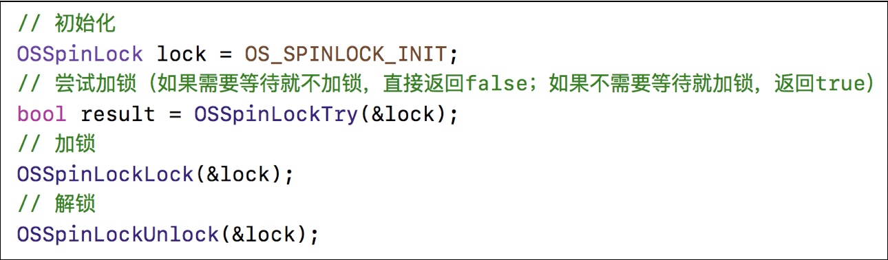
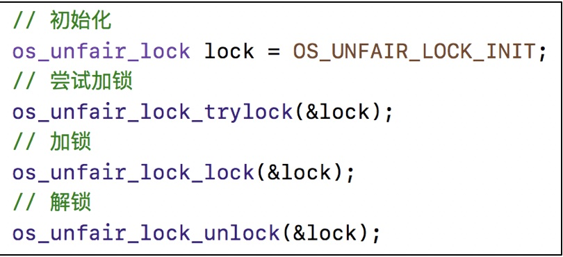
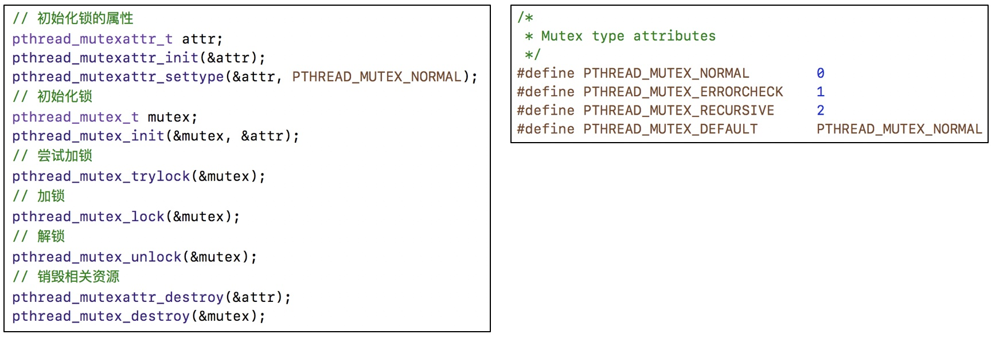
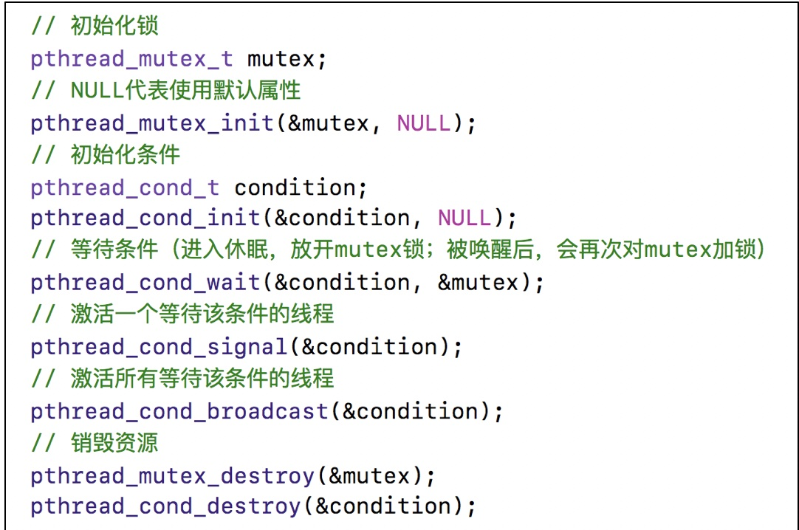
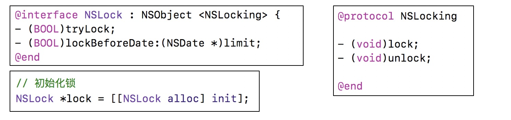
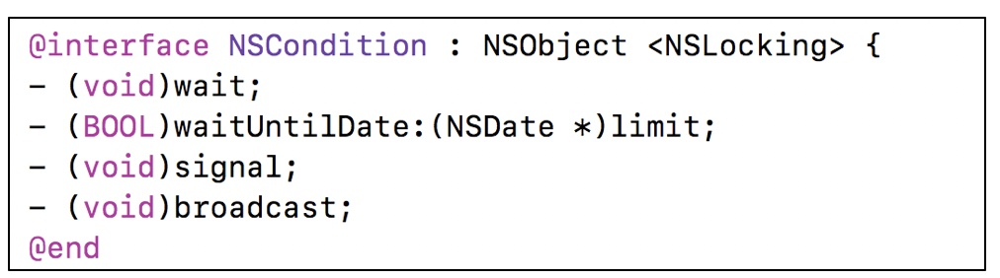
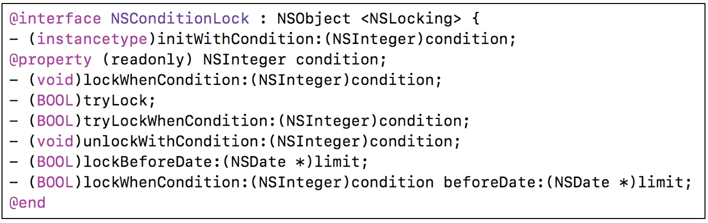
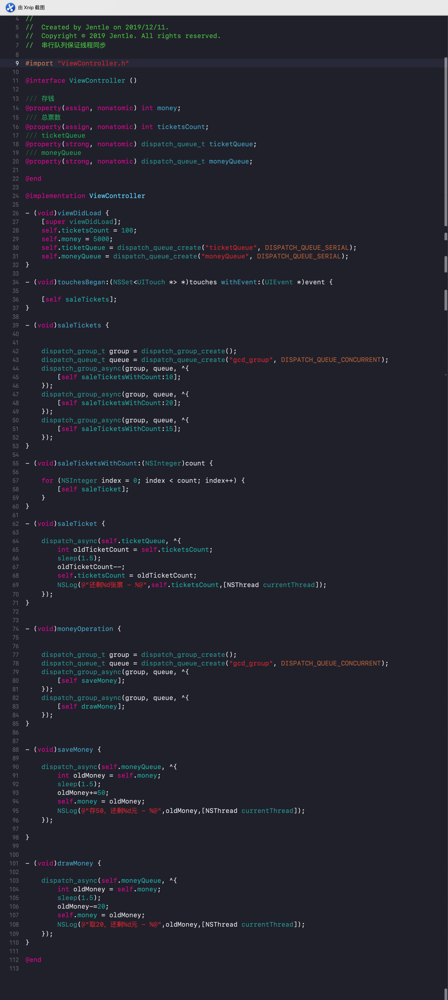

#### 一、 多线程的概念
 
>进程:

* 狭义定义：进程是正在运行的程序的实例（an instance of a computer program that is being executed）。
* 广义定义：进程是一个具有一定独立功能的程序关于某个数据集合的一次运行活动。它是操作系统动态执行的基本单元，在传统的操作系统中，进程既是基本的分配单元，也是基本的执行单元。

>线程:

* 线程（英语：thread）是操作系统能够进行运算调度的最小单位。它被包含在进程之中，是进程中的实际运作单位。一条线程指的是进程中一个单一顺序的控制流，一个进程中可以并发多个线程，每条线程并行执行不同的任务。在Unix System V及SunOS中也被称为轻量进程（lightweight processes），但轻量进程更多指内核线程（kernel thread），而把用户线程（user thread）称为线程。
* 线程是独立调度和分派的基本单位。线程可以为操作系统内核调度的内核线程，如Win32线程；由用户进程自行调度的用户线程，如Linux平台的POSIX Thread；或者由内核与用户进程，如Windows 7的线程，进行混合调度。
* 同一进程中的多条线程将共享该进程中的全部系统资源，如虚拟地址空间，文件描述符和信号处理等等。但同一进程中的多个线程有各自的调用栈（call stack），自己的寄存器环境（register context），自己的线程本地存储（thread-local storage）。
* 一个进程可以有很多线程，每条线程并行执行不同的任务。

> 多线程：

* 多线程（英语：multithreading），是指从软件或者硬件上实现多个线程并发执行的技术。具有多线程能力的计算机因有硬件支持而能够在同一时间执行多于一个线程，进而提升整体处理性能。具有这种能力的系统包括对称多处理机、多核心处理器以及芯片级多处理（Chip-level multithreading）或同时多线程（Simultaneous multithreading）处理器。在一个程序中，这些独立运行的程序片段叫作“线程”（Thread），利用它编程的概念就叫作“多线程处理（Multithreading）”。

> 多任务：

* 多任务处理是指用户可以在同一时间内运行多个应用程序,每个应用程序被称作一个任务.Linux、windows就是支持多任务的操作系统,比起单任务系统它的功能增强了许多。
* 当多任务操作系统使用某种任务调度策略允许两个或更多进程并发共享一个处理器时，事实上处理器在某一时刻只会给一件任务提供服务。因为任务调度机制保证不同任务之间的切换速度十分迅速，因此给人多个任务同时运行的错觉。多任务系统中有3个功能单位：任务、进程和线程。

> 一个程序只有一个主队列, 并且主队列是一个特殊的串行队列。所以说主队列是一个串行队列。

#### 二、 iOS中的常见多线程方案

| 技术方案 |  简介| 语言 | 线程生命周期 | 使用频率 |
| --- | --- | --- | --- | --- |
| pthread | 一套通用的多线程API<br>适用于Unix\Linux\Windows等系统<br>跨平台\可移植<br>使用难度大|C|使用者管理|几乎不用|
|NSThread  | 使用更加面向对象<br>简单易用，可直接操作线程对象| OC | 使用者管理|偶尔使用|
| GCD |旨在替代NSThread等线程技术<br>充分利用设备的多核|C|自动管理|<table><tr><td bgcolor=red>经常使用</td></tr></table>|
| NSOperation |基于GCD（底层是GCD）<br>比GCD多了一些更简单实用的功能<br>使用更加面向对象|OC|自动管理|<table><tr><td bgcolor=red>经常使用</td></tr></table>|


#### 三、 GCD
#### 前言

* 互斥锁

共享资源的使用是互斥的，即一个线程获得资源的使用权后就会将该资源加锁，使用完后会将其解锁，如果在使用过程中有其他线程想要获取该资源的锁，那么它就会被阻塞陷入睡眠状态，直到该资源被解锁才会被唤醒，如果被阻塞的资源不止一个，那么它们都会被唤醒，但是获得资源使用权的是第一个被唤醒的线程，其它线程又陷入沉睡。

* 自旋锁

自旋锁也是广义上的互斥锁, 是互斥锁的实现方式之一, 它不会产生线程的调度, 而是通过"循环"来尝试获取锁, 优点是能很快的获取锁, 缺点是会占用过多的CPU时间, 这被称为忙等待(busy-waiting)。

* 条件变量

条件变量常与互斥锁同时使用，达到线程同步的目的：条件变量通过允许线程阻塞和等待另一个线程发送信号的方法弥补了互斥锁的不足。


#### 3.1 GCD的常用函数
*  用同步的方式执行任务
<br>dispatch\_sync(dispatch\_queue_t queue, dispatch\_block\_t block);
<br>queue：队列
<br>block：任务

* 用异步的方式执行任务
<br>dispatch\_async(dispatch\_queue\_t queue, dispatch\_block\_t block);


#### 3.2 GCD的队列可以分为2大类型
* 并发队列（Concurrent Dispatch Queue）
<br>可以让多个任务并发（同时）执行（自动开启多个线程同时执行任务）
<br>并发功能只有在异步（dispatch\_async）函数下才有效

* 串行队列（Serial Dispatch Queue）
<br>让任务一个接着一个地执行（一个任务执行完毕后，再执行下一个任务）

* dispatch\_queue\_t queue = dispatch\_get\_global\_queue(0, 0);
<br> 全局并发队列

```
- (void)gcd_global_queue_sync {
    ///全局并发队列:允许多个任务并发执行，并发在异步函数下才有效！！！
    dispatch_queue_t queue = dispatch_get_global_queue(0, 0);
    dispatch_sync(queue, ^{
        for (int i = 0; i < 10; i++) {
            NSLog(@"任务1：index = %d %@",i,[NSThread currentThread]);
        }
    });
    
    dispatch_sync(queue, ^{
        for (int i = 0; i < 10; i++) {
            NSLog(@"任务2：index = %d %@",i,[NSThread currentThread]);
        }
    });
    ///主线程中：任务1执行完之后任务2再执行
}
```

```
- (void)gcd_global_queue_async {
    ///全局并发队列:允许多个任务并发执行，并发在异步函数下才有效！！！
    dispatch_queue_t queue = dispatch_get_global_queue(0, 0);
    dispatch_async(queue, ^{
        for (int i = 0; i < 10; i++) {
            NSLog(@"任务1：index = %d %@",i,[NSThread currentThread]);
        }
    });
    
    dispatch_async(queue, ^{
        for (int i = 0; i < 10; i++) {
            NSLog(@"任务2：index = %d %@",i,[NSThread currentThread]);
        }
    });
    ///子线程中：任务1和任务2交替执行
}


```
* dispatch\_queue\_create(const char *\_Nullable label,
		dispatch\_queue\_attr\_t \_Nullable attr)
<br> attr: DISPATCH\_QUEUE\_SERIAL(串行队列)、DISPATCH\_QUEUE\_CONCURRENT（并发队列）
		
```
    ///DISPATCH_QUEUE_SERIAL or a NULL attribute invoke blocks serially in FIFO order
    ///DISPATCH_QUEUE_CONCURRENT attribute may invoke blocks concurrently
    dispatch_queue_t queue = dispatch_queue_create("com.bitatuto.cxt", DISPATCH_QUEUE_SERIAL);
```

```
- (void)queue_create_serial_async {
    
    ///DISPATCH_QUEUE_SERIAL or a NULL attribute invoke blocks serially in FIFO order
    ///DISPATCH_QUEUE_CONCURRENT attribute may invoke blocks concurrently
    dispatch_queue_t queue = dispatch_queue_create("com.bitatuto.cxt", DISPATCH_QUEUE_SERIAL);
    dispatch_async(queue, ^{
        for (int i = 0; i < 10; i++) {
            NSLog(@"任务1：index = %d %@",i,[NSThread currentThread]);
        }
    });
    
    dispatch_async(queue, ^{
        for (int i = 0; i < 10; i++) {
            NSLog(@"任务2：index = %d %@",i,[NSThread currentThread]);
        }
    });
    ///子线程中：任务1执行完之后执行任务2
}

```

```
- (void)queue_create_serial_sync {
    
    ///DISPATCH_QUEUE_SERIAL or a NULL attribute invoke blocks serially in FIFO order
    ///DISPATCH_QUEUE_CONCURRENT attribute may invoke blocks concurrently
    dispatch_queue_t queue = dispatch_queue_create("com.bitatuto.cxt", DISPATCH_QUEUE_SERIAL);
    dispatch_sync(queue, ^{
        for (int i = 0; i < 10; i++) {
            NSLog(@"任务1：index = %d %@",i,[NSThread currentThread]);
        }
    });
    
    dispatch_sync(queue, ^{
        for (int i = 0; i < 10; i++) {
            NSLog(@"任务2：index = %d %@",i,[NSThread currentThread]);
        }
    });
    ///主线程中：任务1执行完之后执行任务2
}


```


```
- (void)queue_create_concurrent_async {
    
    ///DISPATCH_QUEUE_SERIAL or a NULL attribute invoke blocks serially in FIFO order
    ///DISPATCH_QUEUE_CONCURRENT attribute may invoke blocks concurrently
    dispatch_queue_t queue = dispatch_queue_create("com.bitatuto.cxt", DISPATCH_QUEUE_CONCURRENT);
    dispatch_async(queue, ^{
        for (int i = 0; i < 10; i++) {
            NSLog(@"任务1：index = %d %@",i,[NSThread currentThread]);
        }
    });
    
    dispatch_async(queue, ^{
        for (int i = 0; i < 10; i++) {
            NSLog(@"任务2：index = %d %@",i,[NSThread currentThread]);
        }
    });
    ///子线程中：任务1和任务2交替执行
}

```

```
- (void)queue_create_concurrent_sync {
    
    ///DISPATCH_QUEUE_SERIAL or a NULL attribute invoke blocks serially in FIFO order
    ///DISPATCH_QUEUE_CONCURRENT attribute may invoke blocks concurrently
    dispatch_queue_t queue = dispatch_queue_create("com.bitatuto.cxt", DISPATCH_QUEUE_CONCURRENT);
    dispatch_sync(queue, ^{
        for (int i = 0; i < 10; i++) {
            NSLog(@"任务1：index = %d %@",i,[NSThread currentThread]);
        }
    });
    
    dispatch_sync(queue, ^{
        for (int i = 0; i < 10; i++) {
            NSLog(@"任务2：index = %d %@",i,[NSThread currentThread]);
        }
    });
    ///主线程中：任务1执行完之后执行任务2，并发只在异步函数下才有效
}

```

* dispatch_get_main_queue()
<br>串行主队列

```
- (void)gcd_main_queue_sync_crash {
    
    ///串行主队列:任务在主线程执行，主队列添加同步任务会死锁！！！
    dispatch_queue_t queue = dispatch_get_main_queue();
    dispatch_sync(queue, ^{
        for (int i = 0; i < 10; i++) {
            NSLog(@"任务1：index = %d %@",i,[NSThread currentThread]);
        }
    });
}

```
```
- (void)gcd_main_queue_async {
    
    ///串行主队列:任务在主线程执行，主队列添加同步任务会死锁！！！
    dispatch_queue_t queue = dispatch_get_main_queue();
    dispatch_async(queue, ^{
        for (int i = 0; i < 10; i++) {
            NSLog(@"任务1：index = %d %@",i,[NSThread currentThread]);
        }
    });
    
    dispatch_async(queue, ^{
        for (int i = 0; i < 10; i++) {
            NSLog(@"任务2：index = %d %@",i,[NSThread currentThread]);
        }
    });
    ///主线程中：任务1执行完之后执行任务2
}

```


#### 3.3面试题

##### 3.3.1
```
- (void)viewDidLoad {
    [super viewDidLoad];
    ///问题：以下代码是在主线程执行，会不会产生死锁？
    NSLog(@"任务一");//A任务
    dispatch_queue_t queue = dispatch_get_main_queue();
    dispatch_sync(queue, ^{
        NSLog(@"任务二");//B任务
    });
    NSLog(@"任务三");//C任务
}

```

> 分析：

viewDidLoad在主线程中，即是在主队列中，主队列是一个特殊的串行队列。执行到dispatch\_sync时会往主队列中添加B任务，B任务会添加到viewDidLoad任务之后，dispatch\_sync会等待B任务执行完才返回，才能执行C任务，viewDidLoad任务执行完，即是C任务执行完。这样，B任务等待C任务执行，C任务等待B任务，形成死锁。

##### 3.3.2

```
///问题：以下代码是在主线程执行，会不会产生死锁？
    ///会产生死锁
    NSLog(@"任务1");
    dispatch_queue_t queue = dispatch_queue_create("com.bitauto.cxt", DISPATCH_QUEUE_SERIAL);
    dispatch_async(queue, ^{///block0
        NSLog(@"任务2");//A任务
        dispatch_sync(queue, ^{///block1
            NSLog(@"任务3");//B任务
        });
        NSLog(@"任务4");//C任务
    });
    NSLog(@"任务5");
    ///任务1 -> 任务5 -> 任务2 -> 崩溃
```

> 分析：

block0先添加到串行队列中，此时会先执行A任务，随后block1也添加到串行队列中。串行队列中，block1等待block0先执行完，block0又等待block1执行完，才能执行C任务，形成死锁。

##### 3.3.3

```
- (void)interview04{
    ///问题：以下代码是在主线程执行，会不会产生死锁？
    ///不会产生死锁
    NSLog(@"任务1");
    dispatch_queue_t queue = dispatch_queue_create("com.bitauto.cxt", DISPATCH_QUEUE_SERIAL);
    dispatch_queue_t queue0 = dispatch_queue_create("com.bitauto.cxt", DISPATCH_QUEUE_CONCURRENT);
    dispatch_async(queue, ^{///block0
        NSLog(@"任务2");
        dispatch_sync(queue0, ^{///block1
            NSLog(@"任务3");
        });
        NSLog(@"任务4");
    });
    NSLog(@"任务5");
    ///任务1 -> 任务5 -> 任务2 -> 任务3 -> 任务4
}

```


> 分析：

block0和block1不在同一个串行队列中，不存在依赖关系。

不同队列的任务不会造成死锁。

##### 3.3.4

```
- (void)interview05{
    ///问题：以下代码是在主线程执行，会不会产生死锁？
    ///不会产生死锁
    NSLog(@"任务1");
    dispatch_queue_t queue = dispatch_queue_create("com.bitauto.cxt", DISPATCH_QUEUE_CONCURRENT);
    dispatch_async(queue, ^{///block0
        NSLog(@"任务2");
        dispatch_sync(queue, ^{///block1
            NSLog(@"任务3");
        });
        NSLog(@"任务4");
    });
    NSLog(@"任务5");
    ///任务1 -> 任务5 -> 任务2 -> 任务3 -> 任务4
}

```


> 分析：

并发队列，不存在阻塞任务的情况，所以不会造成死锁。

##### 3.3.5

```
NSThread *thread = [[NSThread alloc] initWithBlock:^{
        NSLog(@"1");///A任务
    }];
    [thread start];
    ///崩溃：[ViewController performSelector:onThread:withObject:waitUntilDone:modes:]: target thread exited while waiting for the perform'
    [self performSelector:@selector(printNumber2) onThread:thread withObject:nil waitUntilDone:YES];
    
```
> 分析：

thread执行完A任务后就退出销毁，所以不能再给一个退出的线程添加任务了。
<br>解决方法:

```
NSThread *thread = [[NSThread alloc] initWithBlock:^{
        NSLog(@"1");
        //RunLoop
        [[NSRunLoop currentRunLoop] addPort:[[NSPort alloc] init] forMode:NSDefaultRunLoopMode];
        [[NSRunLoop currentRunLoop] run];
    }];
[thread start];
 ///崩溃：[ViewController performSelector:onThread:withObject:waitUntilDone:modes:]: target thread exited while waiting for the perform'
[self performSelector:@selector(printNumber2) onThread:thread withObject:nil waitUntilDone:YES];
    
```

<font color=#333330 size=4 face="黑体">总结：使用<font color=##FF0000 >sync函数</font>往<font color=#008000>当前</font><font color=#0000FF>串行</font>队列中添加任务，会卡住当前的串行队列（产生死锁）</font>


#### 3.4GCD队列组

> 异步并发执行任务1、任务2
<br>等任务1、任务2都执行完毕后，再回到主线程执行任务3

```
- (void)gcd_group {
    
    dispatch_group_t group = dispatch_group_create();
    dispatch_queue_t queue = dispatch_queue_create("gcd_group", DISPATCH_QUEUE_CONCURRENT);
    dispatch_group_async(group, queue, ^{
        [self taskOne];
    });
    dispatch_group_async(group, queue, ^{
        [self taskTwo];
    });
//    dispatch_group_notify(group, queue, ^{
//        dispatch_async(dispatch_get_main_queue(), ^{
//            [self taskThree];
//        });
//    });
    dispatch_group_notify(group, dispatch_get_main_queue(), ^{
        [self taskThree];
    });
}

- (void)taskOne {
    
    for (int index = 0; index < 5; index ++) {
        NSLog(@"task1 - %d - %@",index,[NSThread currentThread]);
    }
}

- (void)taskTwo {
    for (int index = 0; index < 5; index ++) {
        NSLog(@"task2 - %d - %@",index,[NSThread currentThread]);
    }
}

- (void)taskThree {
    for (int index = 0; index < 5; index ++) {
        NSLog(@"task3 - %d - %@",index,[NSThread currentThread]);
    }
}

```
#### 3.5 多线程的安全隐患

* 资源共享
<br>1块资源可能会被多个线程共享，也就是多个线程可能会访问同一块资源
比如多个线程访问同一个对象、同一个变量、同一个文件
<br>当多个线程访问同一块资源时，很容易引发数据错乱和数据安全问题

* 解决方案：使用线程同步技术（同步，就是协同步调，按预定的先后次序进行）
<br>常见的线程同步技术是：加锁

##### 3.5.1 OSSpinLock自旋锁

* 等待锁的线程会处于忙等（busy-wait）状态，一直占用着CPU资源，相当于while循环。

* 目前已经不再安全，可能会出现优先级反转问题

* 如果等待锁的线程优先级较高，它会一直占用着CPU资源，优先级低的线程就无法释放锁



* 补充：

```
    ///函数调用是在运行时才确定的，static是在编译时期就确定的
    static str1 = [NSString stringWithFormat:@"%@%@",@"cx",@"123"];
    ///除非在编译时期给赋值为nil,函数运行时期再次给赋值
    static NSString *str2 = nil;
    static dispatch_once_t onceToken;
    dispatch_once(&onceToken, ^{
        str2 = [NSString stringWithFormat:@"%@%@",@"cx",@"123"];
    });
```

##### 3.5.2 os\_unfair\_lock

* os\_unfair\_lock用于取代不安全的OSSpinLock ，从iOS10开始才支持
* 从底层调用看，等待os\_unfair\_lock锁的线程会处于休眠状态，并非忙等
* 需要导入头文件#import\<os/lock.h>



##### 3.5.4 pthread\_mutex

* mutex叫做”互斥锁”，等待锁的线程会处于休眠状态
* 需要导入头文件#import <pthread.h>




##### 3.5.5 pthread\_mutex条件


##### 3.5.5 NSLock、NSRecursiveLock、NSCondition

NSLock是对mutex普通锁的封装

<br>NSRecursiveLock也是对mutex递归锁的封装，API跟NSLock基本一致

<br>NSCondition是对mutex和cond的封装



<br>NSConditionLock是对NSCondition的进一步封装，可以设置具体的条件值(设置线程之间的依赖)


<br>串行队列也能保证线程同步




