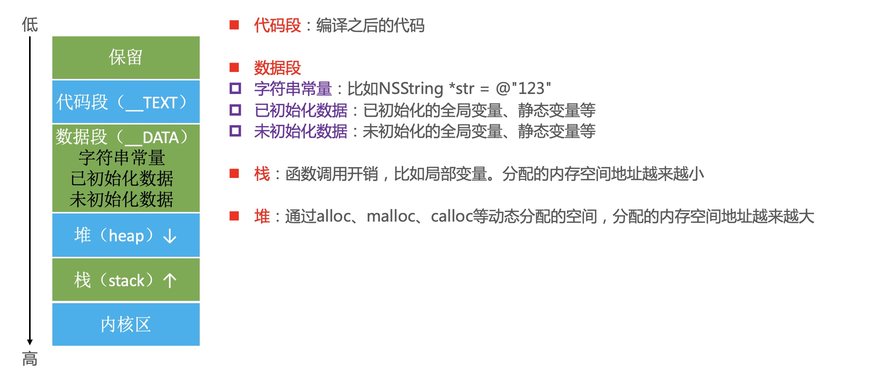
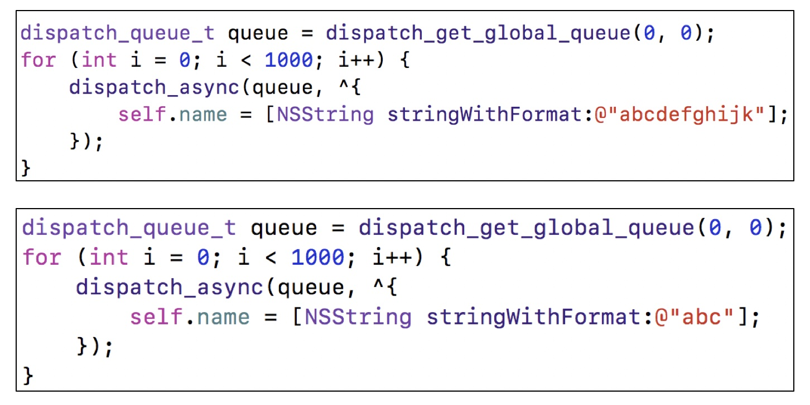
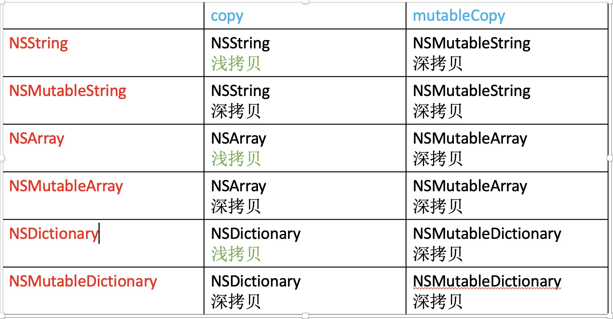

#### 一、 CADisplayLink、NSTimer使用注意
 
> CADisplayLink、NSTimer会对target产生强引用，如果target又对它们产生强引用，那么就会引发循环引用

* 解决方案

1.使用block

```
    __weak typeof(self) weakSelf = self;
    self.timer = [NSTimer scheduledTimerWithTimeInterval:1.0 repeats:YES block:^(NSTimer * _Nonnull timer) {
        [weakSelf timerTest];
    }];

```

2.使用代理对象（NSProxy:负责将消息转发到真正的target的代理类，直接进入消息转发，省去了去父类搜索方法/动态方法解析等流程。）

```
    self.timer = [NSTimer scheduledTimerWithTimeInterval:1.0 target:[JTProxy proxyWithTarget:self] selector:@selector(timerTest) userInfo:nil repeats:YES];
    
    self.link = [CADisplayLink displayLinkWithTarget:[JTProxy proxyWithTarget:self] selector:@selector(linkTest)];
    [self.link addToRunLoop:[NSRunLoop mainRunLoop] forMode:NSDefaultRunLoopMode];

```

```
#import "JTProxy.h"

@interface JTProxy ()

/// delegate
@property(weak, nonatomic) id delegate;

@end

@implementation JTProxy

+ (instancetype)proxyWithTarget:(id)target {
    
    JTProxy *proxy = [[JTProxy alloc] init];
    ///一定是弱引用
    proxy.delegate = target;
    return proxy;
}

///消息转发
- (id)forwardingTargetForSelector:(SEL)aSelector {
    
    return _delegate;
}

- (void)forwardInvocation:(NSInvocation *)anInvocation {
    
    [anInvocation invokeWithTarget:_delegate];
}

@end

```

* NSProxy补充

```
    ///神奇的NSProxy:isMemberOfClass、isKindOfClass等内部的实现进行了消息转发
    JTProxy *proxy = [JTProxy proxyWithTarget:self];
    bool ret1 = [proxy isMemberOfClass:[self class]];
    JTObjectProxy *objProxy = [JTObjectProxy proxyWithTarget:self];
    bool ret2 = [objProxy isMemberOfClass:[self class]];
    NSLog(@"ret1=%d",ret1);//1
    NSLog(@"ret2=%d",ret2);//0
```

#### 二、 GCD定时器

* NSTimer依赖于RunLoop，如果RunLoop的任务过于繁重，可能会导致NSTimer不准时
* 而GCD的定时器会更加准时

```
#import "ViewController.h"


@interface ViewController ()

/// timer
@property(strong, nonatomic) dispatch_source_t timer;

@end

@implementation ViewController

- (void)viewDidLoad {
    [super viewDidLoad];
    [self funcParOnSubThread];
}

- (void)base {
    ///必须强引用timer
    dispatch_source_t timer = dispatch_source_create(DISPATCH_SOURCE_TYPE_TIMER, 0, 0, dispatch_get_main_queue());
    dispatch_source_set_timer(timer, DISPATCH_TIME_NOW, 1 * NSEC_PER_SEC, 0 * NSEC_PER_SEC);
    dispatch_source_set_event_handler(timer, ^{
        NSLog(@"dispatch_timer");
    });
    dispatch_resume(timer);
    self.timer = timer;
}

- (void)funcParOnSubThread {
    
    ///必须强引用timer:
    dispatch_source_t timer = dispatch_source_create(DISPATCH_SOURCE_TYPE_TIMER, 0, 0, dispatch_queue_create("timer", DISPATCH_QUEUE_SERIAL));
    dispatch_source_set_timer(timer, DISPATCH_TIME_NOW, 1 * NSEC_PER_SEC, 0 * NSEC_PER_SEC);
    dispatch_source_set_event_handler_f(timer, timerAction);
    dispatch_resume(timer);
    self.timer = timer;
}

void timerAction(){
    
    NSLog(@"timerAction:%@",[NSThread currentThread]);
}

@end

```

> GCD定时器的封装

```
#import "JTTimer.h"


static NSMutableDictionary *timers;

@interface JTTimer ()

/// timer
@property(strong, nonatomic) dispatch_source_t timer;

@end

@implementation JTTimer

+ (void)initialize {
    
    ///初始化创建字典
    timers = [[NSMutableDictionary alloc] init];
}

+ (NSString *)executeTask:(void(^)(void))task
              delay:(NSTimeInterval)delay
           interval:(NSTimeInterval)interval
            repeats:(BOOL)repeats
              async:(BOOL)async {
    
    if (!task) {return nil;}

    NSString *key = [NSString stringWithFormat:@"%lu",(unsigned long)timers.count];
    ///必须强引用timer
    dispatch_queue_t queue = async ? dispatch_get_global_queue(0, 0) : dispatch_get_main_queue();
    dispatch_source_t timer = dispatch_source_create(DISPATCH_SOURCE_TYPE_TIMER, 0, 0, queue);
    dispatch_source_set_timer(timer, dispatch_time(DISPATCH_TIME_NOW, delay * NSEC_PER_SEC), interval * NSEC_PER_SEC,0);
    dispatch_source_set_event_handler(timer, ^{
        task();
        if (!repeats) {
            dispatch_source_cancel(timer);
        }
    });
    dispatch_resume(timer);
    ///强引用timer
    [timers setValue:timer forKey:key];
    return key;
}

+ (void)cancelTask:(NSString *)timerIdentifier {
    
    if (timerIdentifier == nil || timerIdentifier.length == 0) {return;}
    
    dispatch_source_t source = [timers valueForKey:timerIdentifier];
    dispatch_source_cancel(source);
    [timers removeObjectForKey:timerIdentifier];
}

@end

```
#### 三、 iOS程序的内存布局



#### 四、 Tagged Pointer

从64bit开始，iOS引入了Tagged Pointer技术，用于优化NSNumber、NSDate、NSString等小对象的存储

在没有使用Tagged Pointer之前， NSNumber等对象需要动态分配内存、维护引用计数等，NSNumber指针存储的是堆中NSNumber对象的地址值

使用Tagged Pointer之后，NSNumber指针里面存储的数据变成了：Tag + Data，也就是将数据直接存储在了指针中

当指针不够存储数据时，才会使用动态分配内存的方式来存储数据

objc_msgSend能识别Tagged Pointer，比如NSNumber的intValue方法，直接从指针提取数据，节省了以前的调用开销

* 如何判断一个指针是否为Tagged Pointer？
<br>1.iOS平台，最高有效位是1（第64bit）
<br>2.Mac平台，最低有效位是1


```objc
#import <Foundation/Foundation.h>

/*
 * 在10_14以后苹果对TaggedPointer进行了混淆,与objc_debug_taggedpointer_obfuscator进行了异或运算
 */
extern uintptr_t objc_debug_taggedpointer_obfuscator;
uintptr_t _objc_decodeTaggedPointer_(id  ptr) {
    #pragma clang diagnostic push
    #pragma clang diagnostic ignored "-Wformat"
      NSString *p = [NSString stringWithFormat:@"%ld",ptr];
    #pragma clang diagnostic pop
    
    return [p longLongValue] ^ objc_debug_taggedpointer_obfuscator;
}


int main(int argc, const char * argv[]) {
    @autoreleasepool {
        //在10_14以后苹果对TaggedPointer进行了混淆:
    #pragma clang diagnostic push
    #pragma clang diagnostic ignored "-Wformat"
        NSNumber *number1 = @3;
        NSNumber *number2 = @4;
        NSNumber *number3 = @5;
        NSLog(@"number1=%p",_objc_decodeTaggedPointer_(number1));
        //number1=0x327
        NSLog(@"number2=%p",_objc_decodeTaggedPointer_(number2));
        //number2=0x427
        NSLog(@"number3=%p",_objc_decodeTaggedPointer_(number3));
        //number3=0x527
        
    #pragma clang diagnostic pop
        
    }
    return 0;
}


```

> 面试题：
> 思考以下2段代码能发生什么事？有什么区别？



```objc
#import "ViewController.h"


@interface ViewController ()

/////解决方案1：
//@property(copy, atomic) NSString *name;

@property(copy, nonatomic) NSString *name;

@end

@implementation ViewController

///set方法的实质:ARC底层转为MRC

//- (void)setName:(NSString *)name {
//
//    if (_name != name) {
//        [_name release];
//        _name = [name copy];
//    }
//}

- (void)viewDidLoad {
    [super viewDidLoad];
    
    dispatch_queue_t queue = dispatch_get_global_queue(0, 0);
    for (int i = 0; i < 1000; i++) {
        dispatch_async(queue, ^{
            NSString *a = @"abc";
            NSString *b = @"abcdefghijk";
//            self.name = [NSString stringWithFormat:a];
            self.name = [NSString stringWithFormat:b];
        });
    }
}


@end


```

#### 五、 MRC

> 前言


* 在iOS中，使用引用计数来管理OC对象的内存
* 一个新创建的OC对象引用计数默认是1，当引用计数减为0，OC对象就会销毁，释放其占用的内存空间
* 调用retain会让OC对象的引用计数+1，调用release会让OC对象的引用计数-1

> 内存管理的经验总结

* 当调用alloc、new、copy、mutableCopy方法返回了一个对象，在不需要这个对象时，要调用release或者autorelease来释放它
* 想拥有某个对象，就让它的引用计数+1；不想再拥有某个对象，就让它的引用计数-1


##### 5.1、 关闭自动引用计数

* Build Settings -> Automatic Reference Counting -> NO

##### 5.2、 开启Zombie Object(僵尸对象)检测

* Edit Scheme -> Diagnostics ->勾选 Zombie Objects 

##### 5.3、 MRC常用

* 获取对象的引用计数： object.retainCount
* 让对象的引用计数加一： retain
* 让对象的引用计数减一： release
* 对象执行autorelease方法 或者直接在autoreleasepool中创建对象 ，会将对象添加到当前的autorelease pool中， 当自动释放池销毁时，自动释放池中所有对象做release操作。

##### 5.4、 setter方法的设置对象的内存管理

* 情形1：

```
Person.h

#import <Foundation/Foundation.h>
#import "Dog.h"

NS_ASSUME_NONNULL_BEGIN

@interface Person : NSObject

- (void)setDog:(Dog*)dog;

- (Dog *)dog;

@end

NS_ASSUME_NONNULL_END

```

```
Person.m

#import "Person.h"

@implementation Person
{
    Dog *_dog;
}

- (void)setDog:(Dog*)dog {
    
    _dog = dog;
}

- (Dog *)dog {
    
    return _dog;
}

- (void)dealloc
{
    [super dealloc];
    NSLog(@"%s",__func__);
}

@end

```

```
main.m

    Dog *dog = [[Dog alloc] init];
    Person *p = [[Person alloc] init];
    [p setDog:dog];
    [p release];
    ///输出：
    -[Person dealloc]
```
> 分析：

dog的引用计数为1，始终没有减1的操作，所以不会被释放。
<br>在person释放时候，对dog作release操作

```
Person.m

- (void)dealloc
{
    [_dog release];
    [super dealloc];
    NSLog(@"%s",__func__);
}

```

* 情形2：dog在调用run前作release操作

```
main.m

    Dog *dog = [[Dog alloc] init];
    Person *p = [[Person alloc] init];
    [p setDog:dog];
    [dog release];
    [[p dog] run];
    [p release];
        
```

> 分析：

在[[p dog] run]造成僵尸对象。
_dog在[[p dog] run]之前调用了release，引用计数减1，此时变为0，被系统回收。

解决方法：setDog时，对dog的引用计数加1操作

```
person.m

- (void)setDog:(Dog*)dog {
    
    _dog = [dog retain];
}
        
```

* 情形3：person设置了另一个dog
    
```
main.m

    Dog *dog1 = [[Dog alloc] init];
    Dog *dog2 = [[Dog alloc] init];
    Person *p = [[Person alloc] init];
    
    [p setDog:dog1];
    [p setDog:dog2];
    
    [dog1 release];
    [dog2 release];
    [p release];
    
```

```
@implementation Person
{
    Dog *_dog;
}

- (void)setDog:(Dog*)dog {
    
    _dog = [dog retain];
}

- (Dog *)dog {
    
    return _dog;
}

- (void)dealloc
{
    [_dog release];
    _dog = nil;
    [super dealloc];
    NSLog(@"%s",__func__);
}

@end


```

> 分析：dog1 没有被释放，因为person的dealloc中只对当前的dog2作了release操作

解决方法：先把之前的_dog作release操作操作

```
Person.m

- (void)setDog:(Dog*)dog {
    
    [_dog release];
    _dog = [dog retain];
    
}
```

* 情形4：两次设置为同一个dog,且在之间release dog

```
main.m

    Dog *dog = [[Dog alloc] init];
    Person *p = [[Person alloc] init];
    [p setDog:dog];
    [dog release];
    [p setDog:dog];
    [[p dog] run];
    [p release];

```


```
Person.m

- (void)setDog:(Dog*)dog {
    
    [_dog release];
    _dog = [dog retain];
    
}

- (void)dealloc
{
    [_dog release];
    _dog = nil;
    [super dealloc];
    NSLog(@"%s",__func__);
}

```

> 分析：第二次setDog时候，对\_dog作了release操作，\_dog实际为dog对象，此时引用计数为0，再调用[dog retain]，造成僵尸对象。

解决方法：

```
Person.m

- (void)setDog:(Dog*)dog {
    
    [_dog release];
    _dog = [dog retain];
    
}
```
同时： person的deallco方法中的[\_dog release]; \_dog = nil;可以修改为

```
- (void)dealloc
{
//    [_dog release];
//    _dog = nil;
    self.dog = nil;
    [super dealloc];
    NSLog(@"%s",__func__);
}

```
#### 六、 copy和mutableCopy

* 拷贝的原则：对象之间互不影响
* 1. 深拷贝： 内容拷贝，产生新的对象
* 2. 浅拷贝： 指针拷贝，没有产生新的对象




