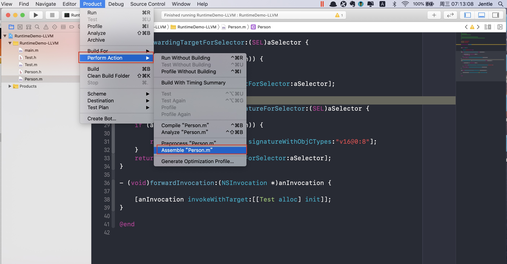

#### 一、常用的命令

#### 1.print、po输出打印

打印变量的值可以使用print（简写p）命令，该命令如果打印的是基础数据类型，则会列出基础数据类型的类型和值。如果是对象，还会打印出对象指针地址，如下所示：

```
(lldb) p str
(__NSCFConstantString *) $1 = 0x000000010c14e068 @"我是一个普通的字符串"
(lldb) p intDemo
(NSInteger) $2 = 2
(lldb)

```

print命令输出的信息中带有 $0 、 $1的字样。我们可以将它看作是lldb内部的变量，我们可以在后面的查询中直接使用这些值。比如现在我要重新取回 $1 的值（或者调用$1的方法都是可以的，注意在使用lldb内部的变量$来记录变量的时候，没有语法提示，所以你需要自己能准确的打印出方法的名字，或者在Xcode编辑器中去打好方法，然后再拷贝到lldb处）

```
(lldb) p $1
(__NSCFConstantString *) $1 = 0x000000010c14e068 @"我是一个普通的字符串"

```

每打印一个与对象相关的命令，$后面的值都会加1

print的打印信息较多，如果只想查看对象的值，则可以使用po（printobject）命令，如下所示：

```
(lldb)  po str
我是一个普通的字符串

(lldb) po intDemo
2

```

对于基础数据类型，还可以指定格式打印，如用16进制的格式打印

```
(lldb) p/x intDemo
(NSInteger) $14 = 0x0000000000000002

```

#### 2.call

call调用方法的意思，和p,po也有此功能，call可以使用在没有返回值，不需要显示输出的情况下，如设置view颜色

```
(lldb) call [self.view setBackgroundColor:[UIColor redColor]]
```

#### 3.GDB命令
可以使用examine命令(简写是x)来查看内存地址中的值。x命令的语法如下所示：
x/<n/f/u> <addr> 其中 n、f、u是可选的参数。
* n是一个正整数，表示需要显示的内存单元的个数，也就是说从当前地址向后显示几个内存单元的内容，一个内存单元的大小由后面的u定义。
* f 表示显示的格式，参见下面。如果地址所指的是字符串，那么格式可以是s，如果地十是指令地址，那么格式可以是i。
* u 表示从当前地址往后请求的字节数，如果不指定的话，GDB默认是4个bytes。u参数可以用下面的字符来代替，b表示单字节，h表示双字节，w表示四字 节，g表示八字节。当我们指定了字节长度后，GDB会从指内存定的内存地址开始，读写指定字节，并把其当作一个值取出来。
* <addr>表示一个内存地址。

#### 4.LLVM中间代码

中间代码的生成一：



中间代码的生成二：

```
clang -emit-llvm -S fileName

```
生成.ll后缀的文件
